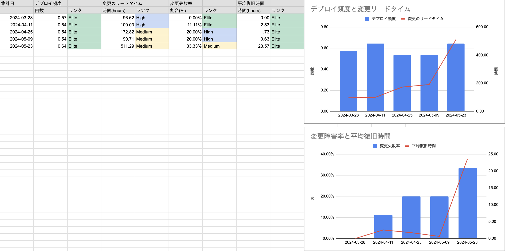

# github-gas-four-keys
## 概要
GitHubからFourKeys統計をGoogleSpreadsheetへ出力するツールです.


## インストレーション
### GitHubアクセストークンの準備
https://github.com/settings/tokens/new からrepoにチェックを入れアクセストークンを発行します(トークンは後ほど使います).

### GAS APIの有効化
https://script.google.com/home/usersettings からGoogle Apps Script APIをオンにします.

### ClaspによるSpreadsheetとGASの作成

1. 以下のシェルを実行. GoogleDrive上に `Github-gas-four-keys` というスプレッドシートが作成されます.
```sh
# clas
npm install @google/clasp -g

git clone https://github.com/cosoji-jp/github-gas-four-keys.git
cd github-gas-four-keys
npm init -y

# ブラウザでログインが求められます.
clasp login
clasp create --type sheets
clasp push
```

2. GoogleDrive上に `Github-gas-four-keys` という名前のスプレッドシートが作られます.
3. 作成されたスプレッドシートの[Apps Script プロジェクト](https://developers.google.com/apps-script/guides/projects?hl=ja#create-from-docs-sheets-slides)を開きます.
4. 以下の[ScriptProperty](https://developers.google.com/apps-script/guides/properties?hl=ja#add_script_properties)を設定します.

|プロパティ|値|
|----|----|
|GITHUB_API_TOKEN|GitHubアクセストークンの準備で作成したトークン. 例) `ghp_` から始まる文字列 |
|GITHUB_REPO_NAMES|レポジトリ名のJSON配列. 例) `["github-gas-four-keys"]`|
|GITHUB_REPO_OWNER|レポジトリのOwnerあるいはOrganization名. 例) `cosoji-jp`|

5. [Apps Script プロジェクト](https://developers.google.com/apps-script/guides/projects?hl=ja#create-from-docs-sheets-slides)から、 `initialize` 関数を実行し、スプレッドシートを初期化します.
6. [Apps Script プロジェクト](https://developers.google.com/apps-script/guides/projects?hl=ja#create-from-docs-sheets-slides)から、 `getAllRepos` 関数を実行し、GithubからPR情報を取得します.
7. SpreadsheetにFourKeys計測結果が表示されます. 集計日などを変更することで自動的に
」「「「

### 自動計測設定
上記手順で `initialize` 関数を実行すると毎週日曜日00:00~01:00で自動的にPRが取得される[トリガー](https://developers.google.com/apps-script/guides/triggers/installable?hl=ja#time-driven_triggers)が設定されます。カスタマイズし任意の時間帯や間隔で実施することもできます.